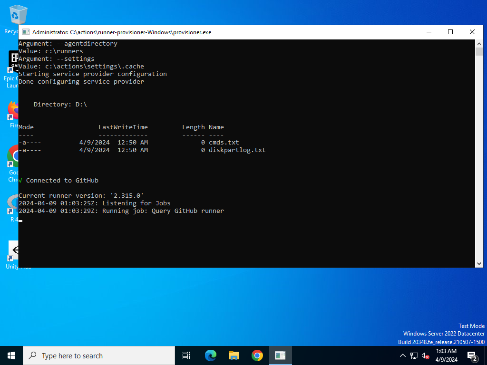

# Query GitHub Runner

This repository defines a workflow that queries a lot of information from the
running environment. This help understanding the differences in behavior on the
runner versus a local environment.

While https://github.com/actions/runner-images provides information about the
base image, it doesn't contain the sources of
`c:\actions\runner-provision-Windows\provisioner.exe`

See recent actions at
https://github.com/maruel/query-github-runner/actions/workflows/query_windows.yml
to see the output of all the things queried in the workflow.

Here's a few interesting bits:

## Take screenshot

I wonder what these two notifications are.



## Invoke-RestMethod http://169.254.169.254/...

Data as of 2024-04-10.

Frankly I was expecting the metadata server to be cloaked. It was not the case.

- VM size is Standard_D4ads_v5.
    - 2 Cores (HyperThreaded), [AMD 3rd Gen EPYC
      7763v](https://www.amd.com/en/products/cpu/amd-epyc-7763), 16GiB of RAM at
      3200MT/s.
    - https://learn.microsoft.com/en-us/azure/virtual-machines/dasv5-dadsv5-series
    - https://cloudprice.net/vm/Standard_D4ads_v5
    - Located in the [westus
      region](https://azure.microsoft.com/en-us/explore/global-infrastructure/products-by-region/?regions=us-west%2cnon-regional&products=all),
      with a list price of 0.428$USD/h.
- Disk is Premium_LRS.
    - 256GiB on [P15 performance
      tier](https://learn.microsoft.com/en-us/azure/virtual-machines/disks-scalability-targets#premium-ssd-managed-disks-per-disk-limits).
    - While the disk is encrypted (does this only mean bitlocker?), secureboot is not enabled nor virtual TPM.
    - Local 150GiB unencrypted temporary local SSD mounted as `D:\`.
    - `pagefile.sys` is on `D:\`.
    - The GitHub Actions work directory is `D:\a`, thus on the high speed local unencrypted
      SSD.
- SKU is not set. This is a custom image.
- GitHub's corp subscription is bd1c5232-854f-4487-b341-930c8ec8497b.


## Get-Disk

While this is not called out here, the second disk is significantly faster.

```
Number Friendly Name Serial Number                    HealthStatus         OperationalStatus      Total Size Partition
                                                                                                             Style
------ ------------- -------------                    ------------         -----------------      ---------- ----------
0      Virtual HD                                     Healthy              Online                     256 GB MBR
1      Virtual HD                                     Healthy              Online                     150 GB MBR
```

## Get-PSDrive

```
Name           Used (GB)     Free (GB) Provider      Root                                               CurrentLocation
----           ---------     --------- --------      ----                                               ---------------
A                                      FileSystem    A:\
Alias                                  Alias
C                 184.13         71.38 FileSystem    C:\
Cert                                   Certificate   \
D                   2.98        147.02 FileSystem    D:\                                 ...-runner\query-github-runner
Env                                    Environment
Function                               Function
HKCU                                   Registry      HKEY_CURRENT_USER
HKLM                                   Registry      HKEY_LOCAL_MACHINE
Variable                               Variable
WSMan                                  WSMan
```


## Get-CimInstance -ClassName Win32_Processor | Format-List -Property *

```
Availability                            : 3
CpuStatus                               : 1
CurrentVoltage                          : 11
DeviceID                                : CPU0
ErrorCleared                            :
ErrorDescription                        :
LastErrorCode                           :
LoadPercentage                          : 2
Status                                  : OK
StatusInfo                              : 3
AddressWidth                            : 64
DataWidth                               : 64
ExtClock                                : 100
L2CacheSize                             :
L2CacheSpeed                            :
MaxClockSpeed                           : 2445
PowerManagementSupported                : False
ProcessorType                           : 3
Revision                                : 257
SocketDesignation                       : None
Version                                 : Model 1, Stepping 1
VoltageCaps                             :
Caption                                 : AMD64 Family 25 Model 1 Stepping 1
Description                             : AMD64 Family 25 Model 1 Stepping 1
InstallDate                             :
Name                                    : AMD EPYC 7763 64-Core Processor
ConfigManagerErrorCode                  :
ConfigManagerUserConfig                 :
CreationClassName                       : Win32_Processor
PNPDeviceID                             :
PowerManagementCapabilities             :
SystemCreationClassName                 : Win32_ComputerSystem
SystemName                              : fv-az980-697
CurrentClockSpeed                       : 2445
Family                                  : 107
OtherFamilyDescription                  :
Role                                    : CPU
Stepping                                : 1
UniqueId                                :
UpgradeMethod                           : 6
Architecture                            : 9
AssetTag                                : None
Characteristics                         :
L3CacheSize                             : 0
L3CacheSpeed                            : 0
Level                                   : 25
Manufacturer                            : AuthenticAMD
NumberOfCores                           : 2
NumberOfEnabledCore                     :
NumberOfLogicalProcessors               : 4
PartNumber                              : None
ProcessorId                             : 178BFBFF00A00F11
SecondLevelAddressTranslationExtensions : False
SerialNumber                            : None
ThreadCount                             :
VirtualizationFirmwareEnabled           : True
VMMonitorModeExtensions                 : False
PSComputerName                          :
CimClass                                : root/cimv2:Win32_Processor
CimInstanceProperties                   : {Caption, Description, InstallDate, Name...}
CimSystemProperties                     : Microsoft.Management.Infrastructure.CimSystemProperties
```


## Get-CimInstance -ClassName Win32_PhysicalMemory

This one is weird.

```
Caption             : Physical Memory
Description         : Physical Memory
Name                : Physical Memory
CreationClassName   : Win32_PhysicalMemory
Manufacturer        : Microsoft
PartNumber          : None
SerialNumber        : None
Tag                 : Physical Memory 0
FormFactor          : 0
BankLabel           : None
Capacity            : 1073741824
InterleavePosition  : 0
MemoryType          : 1
DeviceLocator       : M0
InterleaveDataDepth : 0
SMBIOSMemoryType    : 1
TypeDetail          : 4

Caption             : Physical Memory
Description         : Physical Memory
Name                : Physical Memory
CreationClassName   : Win32_PhysicalMemory
Manufacturer        : Microsoft
PartNumber          : None
SerialNumber        : None
Tag                 : Physical Memory 1
FormFactor          : 0
BankLabel           : None
Capacity            : 16106127360
InterleavePosition  : 0
MemoryType          : 1
DeviceLocator       : M1
InterleaveDataDepth : 0
SMBIOSMemoryType    : 1
TypeDetail          : 4
```


## Get-CimInstance Win32_StartupCommand

```
Command                                                    User   Caption
-------                                                    ----   -------
C:\PROGRA~1\MICROS~4\SERVIC~1\Tools\SERVIC~2\SERVIC~1.EXE  Public Service Fabric Local Cluster Manager
%windir%\system32\SecurityHealthSystray.exe                Public SecurityHealth
%windir%\AzureArcSetup\Systray\AzureArcSysTray.exe         Public AzureArcSetup
```


# Get-WmiObject -Class Win32_Product | Select-Object -Property Name,Version | Sort-Object -Property Name

Why the heck Epic Games Launcher is installed? I hear it's because of Visual
Studio.

```
Name                                                                          Version
----                                                                          -------
.NET Android Templates (x64)                                                  34.0.52.0
.NET MAUI SDK (x64)                                                           8.0.7.0
.NET MAUI Templates (x64)                                                     7.0.101.0
.NET MAUI Templates (x64)                                                     8.0.7.0
Application Verifier x64 External Package                                     10.1.19041.685
Application Verifier x64 External Package                                     10.1.20348.1
Application Verifier x64 External Package                                     10.1.22000.832
Application Verifier x64 External Package (DesktopEditions)                   10.1.22621.3233
Application Verifier x64 External Package (OnecoreUAP)                        10.1.22621.3233
AWS Command Line Interface v2                                                 2.15.36.0
AWS SAM Command Line Interface                                                1.114.0
Azure Cosmos DB Emulator                                                      2.14.16
ClickOnce Bootstrapper Package for Microsoft .NET Framework                   4.8.09037
CMake                                                                         3.29.1
DiagnosticsHub_CollectionService                                              17.6.34629
Enable UEFI SecureBoot Tool                                                   10.1.22621.2428
Entity Framework 6.2.0 Tools  for Visual Studio 2022                          6.2.0.0
Epic Games Launcher                                                           1.3.93.0
Epic Online Services                                                          2.0.44.0
GitHub CLI                                                                    2.47.0
Google Chrome                                                                 123.0.6312.106
icecap_collection_neutral                                                     17.9.34714
icecap_collection_x64                                                         17.9.34714
icecap_collectionresources                                                    17.9.34714
icecap_collectionresourcesx64                                                 17.9.34714
IIS 10.0 Express                                                              10.0.08608
IntelliTraceProfilerProxy                                                     15.0.21225.01
IntelliTraceProfilerProxy                                                     15.0.21225.01
Kits Configuration Installer                                                  10.1.22621.2428
Microsoft .NET 8.0 Templates 8.0.202 (x64)                                    32.7.52897
Microsoft .NET AppHost Pack - 8.0.3 (x64)                                     64.12.10343
Microsoft .NET AppHost Pack - 8.0.3 (x64_arm64)                               64.12.10343
Microsoft .NET AppHost Pack - 8.0.3 (x64_x86)                                 64.12.10343
Microsoft .NET CoreRuntime For CoreCon                                        1.0.0.0
Microsoft .NET CoreRuntime SDK                                                1.1.27004.0
Microsoft .NET Framework 4.5.2 Multi-Targeting Pack                           4.5.51209
Microsoft .NET Framework 4.6 Targeting Pack                                   4.6.00081
Microsoft .NET Framework 4.6.2 Targeting Pack                                 4.6.01590
Microsoft .NET Framework 4.6.2 Targeting Pack (ENU)                           4.6.01590
Microsoft .NET Framework 4.7 Targeting Pack                                   4.7.02053
Microsoft .NET Framework 4.7 Targeting Pack (ENU)                             4.7.02053
Microsoft .NET Framework 4.7.1 Doc Redirected Targeting Pack (ENU)            4.7.02558
Microsoft .NET Framework 4.7.1 Targeting Pack                                 4.7.02558
Microsoft .NET Framework 4.7.2 Targeting Pack                                 4.7.03062
Microsoft .NET Framework 4.7.2 Targeting Pack (ENU)                           4.7.03062
Microsoft .NET Framework 4.8 SDK                                              4.8.03928
Microsoft .NET Framework 4.8 Targeting Pack                                   4.8.03761
Microsoft .NET Framework 4.8 Targeting Pack (ENU)                             4.8.03761
Microsoft .NET Framework 4.8.1 SDK                                            4.8.09037
Microsoft .NET Framework 4.8.1 Targeting Pack                                 4.8.09037
Microsoft .NET Framework 4.8.1 Targeting Pack (ENU)                           4.8.09037
Microsoft .NET Framework Cumulative Intellisense Pack for Visual Studio (ENU) 4.8.09037
Microsoft .NET Host - 6.0.27 (x64)                                            48.108.8828
Microsoft .NET Host - 6.0.27 (x86)                                            48.108.8828
Microsoft .NET Host - 8.0.3 (x64)                                             64.12.10343
Microsoft .NET Host - 8.0.3 (x86)                                             64.12.10343
Microsoft .NET Host FX Resolver - 6.0.27 (x64)                                48.108.8828
Microsoft .NET Host FX Resolver - 6.0.27 (x86)                                48.108.8828
Microsoft .NET Host FX Resolver - 8.0.3 (x64)                                 64.12.10343
Microsoft .NET Host FX Resolver - 8.0.3 (x86)                                 64.12.10343
Microsoft .NET Native SDK                                                     15.0.24211.07
Microsoft .NET Runtime - 6.0.27 (x64)                                         48.108.8828
Microsoft .NET Runtime - 6.0.27 (x86)                                         48.108.8828
Microsoft .NET Runtime - 8.0.3 (x64)                                          64.12.10343
Microsoft .NET Runtime - 8.0.3 (x86)                                          64.12.10343
Microsoft .NET SDK 8.0.202 (x64) from Visual Studio                           8.2.224.11649
Microsoft .NET Standard Targeting Pack - 2.1.0 (x64)                          24.0.28113
Microsoft .NET Targeting Pack - 8.0.3 (x64)                                   64.12.10343
Microsoft .NET Targeting Pack - 8.0.3 (x86)                                   64.12.10343
Microsoft .NET Toolset 8.0.202 (x64)                                          32.7.52897
Microsoft AS OLE DB Provider for SQL Server 2016                              13.1.4561.14
Microsoft ASP.NET Core 6.0.27 Hosting Bundle Options                          6.0.27.24070
Microsoft ASP.NET Core 6.0.27 Shared Framework (x64)                          6.0.27.24070
Microsoft ASP.NET Core 6.0.27 Shared Framework (x86)                          6.0.27.24070
Microsoft ASP.NET Core 8.0.3 Shared Framework (x64)                           8.0.3.24116
Microsoft ASP.NET Core 8.0.3 Shared Framework (x86)                           8.0.3.24116
Microsoft ASP.NET Core 8.0.3 Targeting Pack (x64)                             8.0.3.24116
Microsoft ASP.NET Core 8.0.3 Targeting Pack (x86)                             8.0.3.24116
Microsoft ASP.NET Core Module for IIS Express                                 12.2.18292.0
Microsoft ASP.NET Core Module V2 for IIS Express                              17.0.22116.0
Microsoft ASP.NET Diagnostic Pack for Visual Studio                           17.9.199.22661
Microsoft ASP.NET Web Tools Packages 17.0 - ENU                               17.0.31114.0
Microsoft Azure Authoring Tools - v2.9.7                                      2.9.8999.45
Microsoft Azure CLI (64-bit)                                                  2.59.0
Microsoft Azure Compute Emulator - v2.9.7                                     2.9.8999.43
Microsoft Azure Libraries for .NET – v2.9                                     3.0.2310.23
Microsoft Azure Service Fabric SDK                                            6.1.1436.9590
Microsoft Command Line Utilities 15 for SQL Server                            15.0.1300.359
Microsoft Exchange Web Services Managed API 2.1                               15.0.847.30
Microsoft HTML Help Workshop Package                                          4.74.8702
Microsoft NetStandard SDK                                                     15.0.51105
Microsoft ODBC Driver 17 for SQL Server                                       17.10.5.1
Microsoft OLE DB Driver for SQL Server                                        18.6.7.0
Microsoft Portable Library Multi-Targeting Pack                               17.0.34511.75
Microsoft Portable Library Multi-Targeting Pack Language Pack - enu           17.0.34511.75
Microsoft SQL Server 2016 Analysis Management Objects                         13.1.4561.14
Microsoft SQL Server 2016 Management Objects  (x64)                           13.2.5026.0
Microsoft SQL Server 2019 LocalDB                                             15.0.4153.1
Microsoft SQL Server Data-Tier Application Framework                          162.2.111.2
Microsoft System CLR Types for SQL Server 2016                                13.2.5026.0
Microsoft System CLR Types for SQL Server 2019                                15.0.2000.5
Microsoft TestPlatform SDK Local Feed                                         17.0.0.5175695
Microsoft UniversalWindowsPlatform SDK                                        15.9.16
Microsoft Visual C++ 2013 x64 Additional Runtime - 12.0.40660                 12.0.40660
Microsoft Visual C++ 2013 x64 Minimum Runtime - 12.0.40660                    12.0.40660
Microsoft Visual C++ 2022 X64 Additional Runtime - 14.38.33135                14.38.33135
Microsoft Visual C++ 2022 X64 Debug Runtime - 14.38.33135                     14.38.33135
Microsoft Visual C++ 2022 X64 Minimum Runtime - 14.38.33135                   14.38.33135
Microsoft Visual C++ 2022 X86 Additional Runtime - 14.38.33135                14.38.33135
Microsoft Visual C++ 2022 X86 Debug Runtime - 14.38.33135                     14.38.33135
Microsoft Visual C++ 2022 X86 Minimum Runtime - 14.38.33135                   14.38.33135
Microsoft Visual Studio 2010 Tools for Office Runtime (x64)                   10.0.60915
Microsoft Visual Studio Setup Configuration                                   3.9.2148.60653
Microsoft Visual Studio Setup WMI Provider                                    3.9.2148.60653
Microsoft Visual Studio Tools for Applications 2022 x64 Hosting Support       17.0.33617
Microsoft Visual Studio Tools for Applications 2022 x86 Hosting Support       17.0.33617
Microsoft Web Deploy 4.0                                                      10.0.8215
Microsoft Web Platform Installer 5.1                                          5.1.51515.0
Microsoft Windows Communication Foundation Diagnostic Pack for x86            17.9.34511
Microsoft Windows Desktop Runtime - 8.0.3 (x64)                               64.12.10377
Microsoft Windows Desktop Runtime - 8.0.3 (x86)                               64.12.10377
Microsoft Windows Desktop Targeting Pack - 8.0.3 (x64)                        64.12.10377
Microsoft Windows Desktop Targeting Pack - 8.0.3 (x86)                        64.12.10377
Microsoft Workflow Debugger v1.0 for amd64                                    17.0.34511
Microsoft Workflow Debugger v1.0 for x86                                      17.0.34511
Microsoft Workflow Diagnostic Pack for x64                                    17.9.34511
Microsoft.Android.Ref.34 (x64)                                                34.0.52.0
Microsoft.Android.Runtime.34.android-arm (x64)                                34.0.52.0
Microsoft.Android.Runtime.34.android-arm64 (x64)                              34.0.52.0
Microsoft.Android.Runtime.34.android-x64 (x64)                                34.0.52.0
Microsoft.Android.Runtime.34.android-x86 (x64)                                34.0.52.0
Microsoft.Android.Sdk.Windows (x64)                                           33.0.95.0
Microsoft.Android.Sdk.Windows (x64)                                           34.0.52.0
Microsoft.AspNetCore.Components.WebView.Maui (x64)                            8.0.7.0
Microsoft.iOS.Ref (x64)                                                       17.2.8004.0
Microsoft.iOS.Runtime.ios-arm64 (x64)                                         17.2.8004.0
Microsoft.iOS.Runtime.iossimulator-arm64 (x64)                                17.2.8004.0
Microsoft.iOS.Runtime.iossimulator-x64 (x64)                                  17.2.8004.0
Microsoft.iOS.Sdk (x64)                                                       16.4.7129.0
Microsoft.iOS.Sdk (x64)                                                       17.2.8004.0
Microsoft.iOS.Templates (x64)                                                 17.2.8004.0
Microsoft.iOS.Windows.Sdk (x64)                                               16.4.7129.0
Microsoft.iOS.Windows.Sdk (x64)                                               17.2.8004.0
Microsoft.MacCatalyst.Ref (x64)                                               17.2.8004.0
Microsoft.MacCatalyst.Runtime.maccatalyst-arm64 (x64)                         17.2.8004.0
Microsoft.MacCatalyst.Runtime.maccatalyst-x64 (x64)                           17.2.8004.0
Microsoft.MacCatalyst.Sdk (x64)                                               16.4.7129.0
Microsoft.MacCatalyst.Sdk (x64)                                               17.2.8004.0
Microsoft.MacCatalyst.Templates (x64)                                         17.2.8004.0
Microsoft.Maui.Controls (x64)                                                 8.0.7.0
Microsoft.Maui.Controls.Build.Tasks (x64)                                     8.0.7.0
Microsoft.Maui.Controls.Compatibility (x64)                                   8.0.7.0
Microsoft.Maui.Controls.Core (x64)                                            8.0.7.0
Microsoft.Maui.Controls.Xaml (x64)                                            8.0.7.0
Microsoft.Maui.Core (x64)                                                     8.0.7.0
Microsoft.Maui.Essentials (x64)                                               8.0.7.0
Microsoft.Maui.Graphics (x64)                                                 8.0.7.0
Microsoft.Maui.Graphics.Win2D.WinUI.Desktop (x64)                             8.0.7.0
Microsoft.Maui.Resizetizer (x64)                                              8.0.7.0
Microsoft.Maui.Resizetizer.Sdk (x64)                                          7.0.101.0
Microsoft.Maui.Sdk (x64)                                                      7.0.101.0
Microsoft.NET.Runtime.Emscripten.Cache (x64)                                  8.0.3.0
Microsoft.NET.Runtime.Emscripten.Node (x64)                                   8.0.3.0
Microsoft.NET.Runtime.Emscripten.Python (x64)                                 8.0.3.0
Microsoft.NET.Runtime.Emscripten.Sdk (x64)                                    8.0.3.0
Microsoft.NET.Runtime.MonoAOTCompiler.Task (x64)                              7.0.17.0
Microsoft.NET.Runtime.MonoAOTCompiler.Task (x64)                              8.0.3.0
Microsoft.NET.Runtime.MonoTargets.Sdk (x64)                                   7.0.17.0
Microsoft.NET.Runtime.MonoTargets.Sdk (x64)                                   8.0.3.0
Microsoft.NET.Runtime.WebAssembly.Sdk (x64)                                   8.0.3.0
Microsoft.NET.Sdk.Android.Manifest-8.0.100 (x64)                              34.0.52
Microsoft.NET.Sdk.Aspire.Manifest-8.0.100 (x64)                               64.0.5426
Microsoft.NET.Sdk.iOS.Manifest-8.0.100 (x64)                                  17.2.8004
Microsoft.NET.Sdk.MacCatalyst.Manifest-8.0.100 (x64)                          17.2.8004
Microsoft.NET.Sdk.macOS.Manifest-8.0.100 (x64)                                14.2.8004
Microsoft.NET.Sdk.Maui.Manifest-8.0.100 (x64)                                 8.0.7
Microsoft.NET.Sdk.tvOS.Manifest-8.0.100 (x64)                                 17.2.8004
Microsoft.NET.Workload.Emscripten.Current.Manifest (x64)                      64.12.10243
Microsoft.NET.Workload.Emscripten.net6.Manifest (x64)                         64.12.10243
Microsoft.NET.Workload.Emscripten.net7.Manifest (x64)                         64.12.10243
Microsoft.NET.Workload.Mono.Toolchain.Current.Manifest (x64)                  64.12.10343
Microsoft.NET.Workload.Mono.Toolchain.net6.Manifest (x64)                     64.12.10343
Microsoft.NET.Workload.Mono.Toolchain.net7.Manifest (x64)                     64.12.10343
Microsoft.NETCore.App.Runtime.AOT.win-x64.Cross.android-arm (x64)             7.0.17.0
Microsoft.NETCore.App.Runtime.AOT.win-x64.Cross.android-arm (x64)             8.0.3.0
Microsoft.NETCore.App.Runtime.AOT.win-x64.Cross.android-arm64 (x64)           7.0.17.0
Microsoft.NETCore.App.Runtime.AOT.win-x64.Cross.android-arm64 (x64)           8.0.3.0
Microsoft.NETCore.App.Runtime.AOT.win-x64.Cross.android-x64 (x64)             7.0.17.0
Microsoft.NETCore.App.Runtime.AOT.win-x64.Cross.android-x64 (x64)             8.0.3.0
Microsoft.NETCore.App.Runtime.AOT.win-x64.Cross.android-x86 (x64)             7.0.17.0
Microsoft.NETCore.App.Runtime.AOT.win-x64.Cross.android-x86 (x64)             8.0.3.0
Microsoft.NETCore.App.Runtime.AOT.win-x64.Cross.browser-wasm (x64)            8.0.3.0
Microsoft.NETCore.App.Runtime.Mono.android-arm (x64)                          7.0.17.0
Microsoft.NETCore.App.Runtime.Mono.android-arm (x64)                          8.0.3.0
Microsoft.NETCore.App.Runtime.Mono.android-arm64 (x64)                        7.0.17.0
Microsoft.NETCore.App.Runtime.Mono.android-arm64 (x64)                        8.0.3.0
Microsoft.NETCore.App.Runtime.Mono.android-x64 (x64)                          7.0.17.0
Microsoft.NETCore.App.Runtime.Mono.android-x64 (x64)                          8.0.3.0
Microsoft.NETCore.App.Runtime.Mono.android-x86 (x64)                          7.0.17.0
Microsoft.NETCore.App.Runtime.Mono.android-x86 (x64)                          8.0.3.0
Microsoft.NETCore.App.Runtime.Mono.browser-wasm (x64)                         8.0.3.0
Microsoft.NETCore.App.Runtime.Mono.ios-arm (x64)                              7.0.17.0
Microsoft.NETCore.App.Runtime.Mono.ios-arm64 (x64)                            7.0.17.0
Microsoft.NETCore.App.Runtime.Mono.ios-arm64 (x64)                            8.0.3.0
Microsoft.NETCore.App.Runtime.Mono.iossimulator-arm64 (x64)                   7.0.17.0
Microsoft.NETCore.App.Runtime.Mono.iossimulator-arm64 (x64)                   8.0.3.0
Microsoft.NETCore.App.Runtime.Mono.iossimulator-x64 (x64)                     7.0.17.0
Microsoft.NETCore.App.Runtime.Mono.iossimulator-x64 (x64)                     8.0.3.0
Microsoft.NETCore.App.Runtime.Mono.iossimulator-x86 (x64)                     7.0.17.0
Microsoft.NETCore.App.Runtime.Mono.maccatalyst-arm64 (x64)                    7.0.17.0
Microsoft.NETCore.App.Runtime.Mono.maccatalyst-arm64 (x64)                    8.0.3.0
Microsoft.NETCore.App.Runtime.Mono.maccatalyst-x64 (x64)                      7.0.17.0
Microsoft.NETCore.App.Runtime.Mono.maccatalyst-x64 (x64)                      8.0.3.0
Minimal WLPC Content                                                          10.1.22621.2428
MongoDB 5.0.26 2008R2Plus SSL (64 bit)                                        5.0.26
MSI Development Tools                                                         10.1.19041.685
MSI Development Tools                                                         10.1.20348.1
MSI Development Tools                                                         10.1.22000.832
MSI Development Tools                                                         10.1.22621.3233
MySQL Server 8.0                                                              8.0.36
Network Monitor Parsers                                                       10.1.22621.2428
Node.js                                                                       18.18.2
OA3Tool                                                                       10.1.22621.2428
OEM Test Certificates (OnecoreUAP)                                            10.1.22621.2428
OneCoreUap_ApiValidator_WDK_Kit_Content                                       10.1.22621.2428
OneCoreUap_WDTF_Headers_and_Libs_Kit_Content                                  10.1.22621.2428
Open XML SDK 2.5 for Microsoft Office                                         2.5.5631
PowerShell 7-x64                                                              7.4.1.0
PowerShell Extensions for SQL Server 2016                                     13.2.5026.0
Python 3.10.11 Core Interpreter (32-bit)                                      3.10.11150.0
Python 3.10.11 Core Interpreter (64-bit)                                      3.10.11150.0
Python 3.10.11 Development Libraries (32-bit)                                 3.10.11150.0
Python 3.10.11 Development Libraries (64-bit)                                 3.10.11150.0
Python 3.10.11 Documentation (32-bit)                                         3.10.11150.0
Python 3.10.11 Documentation (64-bit)                                         3.10.11150.0
Python 3.10.11 Executables (32-bit)                                           3.10.11150.0
Python 3.10.11 Executables (64-bit)                                           3.10.11150.0
Python 3.10.11 pip Bootstrap (32-bit)                                         3.10.11150.0
Python 3.10.11 pip Bootstrap (64-bit)                                         3.10.11150.0
Python 3.10.11 Standard Library (32-bit)                                      3.10.11150.0
Python 3.10.11 Standard Library (64-bit)                                      3.10.11150.0
Python 3.10.11 Tcl/Tk Support (32-bit)                                        3.10.11150.0
Python 3.10.11 Tcl/Tk Support (64-bit)                                        3.10.11150.0
Python 3.10.11 Test Suite (32-bit)                                            3.10.11150.0
Python 3.10.11 Test Suite (64-bit)                                            3.10.11150.0
Python 3.10.11 Utility Scripts (32-bit)                                       3.10.11150.0
Python 3.10.11 Utility Scripts (64-bit)                                       3.10.11150.0
Python 3.11.9 Core Interpreter (32-bit)                                       3.11.9150.0
Python 3.11.9 Core Interpreter (64-bit)                                       3.11.9150.0
Python 3.11.9 Development Libraries (32-bit)                                  3.11.9150.0
Python 3.11.9 Development Libraries (64-bit)                                  3.11.9150.0
Python 3.11.9 Documentation (32-bit)                                          3.11.9150.0
Python 3.11.9 Documentation (64-bit)                                          3.11.9150.0
Python 3.11.9 Executables (32-bit)                                            3.11.9150.0
Python 3.11.9 Executables (64-bit)                                            3.11.9150.0
Python 3.11.9 pip Bootstrap (32-bit)                                          3.11.9150.0
Python 3.11.9 pip Bootstrap (64-bit)                                          3.11.9150.0
Python 3.11.9 Standard Library (32-bit)                                       3.11.9150.0
Python 3.11.9 Standard Library (64-bit)                                       3.11.9150.0
Python 3.11.9 Tcl/Tk Support (32-bit)                                         3.11.9150.0
Python 3.11.9 Tcl/Tk Support (64-bit)                                         3.11.9150.0
Python 3.11.9 Test Suite (32-bit)                                             3.11.9150.0
Python 3.11.9 Test Suite (64-bit)                                             3.11.9150.0
Python 3.11.9 Utility Scripts (32-bit)                                        3.11.9150.0
Python 3.11.9 Utility Scripts (64-bit)                                        3.11.9150.0
Python 3.12.2 Core Interpreter (32-bit)                                       3.12.2150.0
Python 3.12.2 Core Interpreter (64-bit)                                       3.12.2150.0
Python 3.12.2 Development Libraries (32-bit)                                  3.12.2150.0
Python 3.12.2 Development Libraries (64-bit)                                  3.12.2150.0
Python 3.12.2 Documentation (32-bit)                                          3.12.2150.0
Python 3.12.2 Documentation (64-bit)                                          3.12.2150.0
Python 3.12.2 Executables (32-bit)                                            3.12.2150.0
Python 3.12.2 Executables (64-bit)                                            3.12.2150.0
Python 3.12.2 pip Bootstrap (32-bit)                                          3.12.2150.0
Python 3.12.2 pip Bootstrap (64-bit)                                          3.12.2150.0
Python 3.12.2 Standard Library (32-bit)                                       3.12.2150.0
Python 3.12.2 Standard Library (64-bit)                                       3.12.2150.0
Python 3.12.2 Tcl/Tk Support (32-bit)                                         3.12.2150.0
Python 3.12.2 Tcl/Tk Support (64-bit)                                         3.12.2150.0
Python 3.12.2 Test Suite (32-bit)                                             3.12.2150.0
Python 3.12.2 Test Suite (64-bit)                                             3.12.2150.0
Python 3.7.9 Core Interpreter (32-bit)                                        3.7.9150.0
Python 3.7.9 Core Interpreter (64-bit)                                        3.7.9150.0
Python 3.7.9 Development Libraries (32-bit)                                   3.7.9150.0
Python 3.7.9 Development Libraries (64-bit)                                   3.7.9150.0
Python 3.7.9 Documentation (32-bit)                                           3.7.9150.0
Python 3.7.9 Documentation (64-bit)                                           3.7.9150.0
Python 3.7.9 Executables (32-bit)                                             3.7.9150.0
Python 3.7.9 Executables (64-bit)                                             3.7.9150.0
Python 3.7.9 pip Bootstrap (32-bit)                                           3.7.9150.0
Python 3.7.9 pip Bootstrap (64-bit)                                           3.7.9150.0
Python 3.7.9 Standard Library (32-bit)                                        3.7.9150.0
Python 3.7.9 Standard Library (64-bit)                                        3.7.9150.0
Python 3.7.9 Tcl/Tk Support (32-bit)                                          3.7.9150.0
Python 3.7.9 Tcl/Tk Support (64-bit)                                          3.7.9150.0
Python 3.7.9 Test Suite (32-bit)                                              3.7.9150.0
Python 3.7.9 Test Suite (64-bit)                                              3.7.9150.0
Python 3.7.9 Utility Scripts (32-bit)                                         3.7.9150.0
Python 3.7.9 Utility Scripts (64-bit)                                         3.7.9150.0
Python 3.8.10 Core Interpreter (32-bit)                                       3.8.10150.0
Python 3.8.10 Core Interpreter (64-bit)                                       3.8.10150.0
Python 3.8.10 Development Libraries (32-bit)                                  3.8.10150.0
Python 3.8.10 Development Libraries (64-bit)                                  3.8.10150.0
Python 3.8.10 Documentation (32-bit)                                          3.8.10150.0
Python 3.8.10 Documentation (64-bit)                                          3.8.10150.0
Python 3.8.10 Executables (32-bit)                                            3.8.10150.0
Python 3.8.10 Executables (64-bit)                                            3.8.10150.0
Python 3.8.10 pip Bootstrap (32-bit)                                          3.8.10150.0
Python 3.8.10 pip Bootstrap (64-bit)                                          3.8.10150.0
Python 3.8.10 Standard Library (32-bit)                                       3.8.10150.0
Python 3.8.10 Standard Library (64-bit)                                       3.8.10150.0
Python 3.8.10 Tcl/Tk Support (32-bit)                                         3.8.10150.0
Python 3.8.10 Tcl/Tk Support (64-bit)                                         3.8.10150.0
Python 3.8.10 Test Suite (32-bit)                                             3.8.10150.0
Python 3.8.10 Test Suite (64-bit)                                             3.8.10150.0
Python 3.8.10 Utility Scripts (32-bit)                                        3.8.10150.0
Python 3.8.10 Utility Scripts (64-bit)                                        3.8.10150.0
Python 3.9.13 Core Interpreter (32-bit)                                       3.9.13150.0
Python 3.9.13 Core Interpreter (64-bit)                                       3.9.13150.0
Python 3.9.13 Development Libraries (32-bit)                                  3.9.13150.0
Python 3.9.13 Development Libraries (64-bit)                                  3.9.13150.0
Python 3.9.13 Documentation (32-bit)                                          3.9.13150.0
Python 3.9.13 Documentation (64-bit)                                          3.9.13150.0
Python 3.9.13 Executables (32-bit)                                            3.9.13150.0
Python 3.9.13 Executables (64-bit)                                            3.9.13150.0
Python 3.9.13 pip Bootstrap (32-bit)                                          3.9.13150.0
Python 3.9.13 pip Bootstrap (64-bit)                                          3.9.13150.0
Python 3.9.13 Standard Library (32-bit)                                       3.9.13150.0
Python 3.9.13 Standard Library (64-bit)                                       3.9.13150.0
Python 3.9.13 Tcl/Tk Support (32-bit)                                         3.9.13150.0
Python 3.9.13 Tcl/Tk Support (64-bit)                                         3.9.13150.0
Python 3.9.13 Test Suite (32-bit)                                             3.9.13150.0
Python 3.9.13 Test Suite (64-bit)                                             3.9.13150.0
Python 3.9.13 Utility Scripts (32-bit)                                        3.9.13150.0
Python 3.9.13 Utility Scripts (64-bit)                                        3.9.13150.0
Python Launcher                                                               3.12.2150.0
sbt 1.9.9                                                                     1.9.9
SDK ARM Additions                                                             10.1.22621.3233
SDK ARM Additions EULA                                                        10.1.22621.2428
SDK ARM Redistributables                                                      10.1.22621.3233
SDK Debuggers ARM                                                             10.1.22621.2428
Session Manager Plugin                                                        1.2.553.0
sptools_Microsoft.VisualStudio.OfficeDeveloperTools.Msi                       16.0.29931
sptools_Microsoft.VisualStudio.Vsto.Msi                                       17.6.34202
sptools_Microsoft.VisualStudio.Vsto.Msi.Resources                             17.6.34202
sptools_Microsoft.VisualStudio.Vsto.Msi.x64                                   17.6.34202
SQL Server Integration Services 2016                                          13.3.7030.0
SQL Server Integration Services Singleton                                     14.0.3012.0
SQL Server Integration Services Singleton                                     15.0.2003.0
SQL Server Integration Services Singleton                                     16.0.5397.1
Strawberry Perl (64-bit)                                                      5.32.1001
TortoiseSVN 1.14.5.29465 (64 bit)                                             1.14.29465
Universal CRT Extension SDK                                                   10.0.26624
Universal CRT Extension SDK                                                   10.1.17763.132
Universal CRT Extension SDK                                                   10.1.19041.685
Universal CRT Extension SDK                                                   10.1.20348.1
Universal CRT Extension SDK                                                   10.1.22000.832
Universal CRT Extension SDK                                                   10.1.22621.3233
Universal CRT Headers Libraries and Sources                                   10.0.26624
Universal CRT Headers Libraries and Sources                                   10.1.17763.132
Universal CRT Headers Libraries and Sources                                   10.1.19041.685
Universal CRT Headers Libraries and Sources                                   10.1.20348.1
Universal CRT Headers Libraries and Sources                                   10.1.22000.832
Universal CRT Headers Libraries and Sources                                   10.1.22621.3233
Universal CRT Redistributable                                                 10.0.26624
Universal CRT Redistributable                                                 10.1.17763.132
Universal CRT Redistributable                                                 10.1.19041.685
Universal CRT Redistributable                                                 10.1.20348.1
Universal CRT Redistributable                                                 10.1.22000.832
Universal CRT Redistributable                                                 10.1.22621.3233
Universal CRT Tools x64                                                       10.1.22621.3233
Universal CRT Tools x86                                                       10.1.22621.3233
Universal General MIDI DLS Extension SDK                                      10.1.17763.132
Universal General MIDI DLS Extension SDK                                      10.1.19041.685
Universal General MIDI DLS Extension SDK                                      10.1.20348.1
Universal General MIDI DLS Extension SDK                                      10.1.22000.832
Universal General MIDI DLS Extension SDK                                      10.1.22621.3233
vcpp_crt.redist.clickonce                                                     14.38.33135
Visual C++ Library CRT Appx Package                                           14.39.33519
Visual C++ Library CRT Appx Package                                           14.39.33519
Visual C++ Library CRT Appx Resource Package                                  14.39.33519
Visual C++ Library CRT ARM64 Appx Package                                     14.39.33519
Visual C++ Library CRT ARM64 Appx Package                                     14.39.33519
Visual C++ Library CRT Desktop Appx Package                                   14.39.33519
Visual C++ Library CRT Desktop Appx Package                                   14.39.33519
Visual C++ Library CRT Desktop Appx Package                                   14.39.33519
VS Immersive Activate Helper                                                  17.0.125.0
VS JIT Debugger                                                               17.0.125.0
VS Script Debugging Common                                                    17.0.125.0
VS WCF Debugging                                                              17.0.125.0
vs_BlendMsi                                                                   17.9.34511
vs_clickoncebootstrappermsi                                                   17.9.34511
vs_clickoncebootstrappermsires                                                17.9.34511
vs_clickoncesigntoolmsi                                                       17.9.34511
vs_codecoveragemsi                                                            17.9.34511
vs_codeduitestframeworkmsi                                                    17.9.34511
vs_communitymsires                                                            17.9.34511
vs_communitysharedmsi                                                         17.9.34714
vs_communityx64msi                                                            17.9.34714
vs_CoreEditorFonts                                                            17.7.40001
vs_cuitcommoncoremsi17                                                        17.9.34511
vs_cuitextensionmsi17                                                         17.9.34511
vs_cuitextensionmsi17_x64                                                     17.9.34511
vs_devenvsharedmsi                                                            17.9.34511
vs_devenx64vmsi                                                               17.9.34511
vs_filehandler_amd64                                                          17.9.34714
vs_filehandler_x86                                                            17.9.34714
vs_FileTracker_Singleton                                                      17.9.34714
vs_githubprotocolhandlermsi                                                   17.9.34511
vs_Graphics_Singletonx64                                                      17.9.34511
vs_Graphics_Singletonx86                                                      17.9.34511
vs_loadtestexceladdinmsi                                                      17.9.34511
vs_minshellinteropsharedmsi                                                   17.9.34511
vs_minshellinteropx64msi                                                      17.9.34511
vs_minshellmsires                                                             17.9.34511
vs_minshellsharedmsi                                                          17.9.34511
vs_minshellx64msi                                                             17.9.34714
vs_networkemulationmsi_x64                                                    17.9.34511
vs_SQLClickOnceBootstrappermsi                                                17.9.34511
vs_tipsmsi                                                                    17.9.34511
vs_vswebprotocolselectormsi                                                   17.9.34511
vs_webtestrecordermsi                                                         17.9.34714
vs_webtestrecordermsi_x64                                                     17.9.34511
WinAppDeploy                                                                  10.1.17763.132
WinAppDeploy                                                                  10.1.19041.685
WinAppDeploy                                                                  10.1.20348.1
WinAppDeploy                                                                  10.1.22000.832
WinAppDeploy                                                                  10.1.22621.3233
Windows App Certification Kit Native Components                               10.1.22621.3233
Windows App Certification Kit SupportedApiList x86                            10.1.22621.3233
Windows App Certification Kit x64                                             10.1.22621.3233
Windows App Certification Kit x64 (OnecoreUAP)                                10.1.22621.3233
Windows Application Driver                                                    1.2.1.0
Windows Content Versioned                                                     10.1.22621.2428
Windows Debugging WDK Integration Versioned                                   10.1.22621.2428
Windows Deployment Image Servicing and Management Tools (OnecoreUAP)          10.1.22621.2428
Windows Desktop Extension SDK                                                 10.1.17763.132
Windows Desktop Extension SDK                                                 10.1.19041.685
Windows Desktop Extension SDK                                                 10.1.20348.1
Windows Desktop Extension SDK                                                 10.1.22000.832
Windows Desktop Extension SDK                                                 10.1.22621.3233
Windows Desktop Extension SDK Contracts                                       10.1.17763.132
Windows Desktop Extension SDK Contracts                                       10.1.19041.685
Windows Desktop Extension SDK Contracts                                       10.1.20348.1
Windows Desktop Extension SDK Contracts                                       10.1.22000.832
Windows Desktop Extension SDK Contracts                                       10.1.22621.3233
Windows Driver Framework ARM Headers and Libs                                 10.1.22621.2428
Windows Driver Framework Headers and Libs                                     10.1.22621.2428
Windows Driver Kit                                                            10.1.22621.2428
Windows Driver Kit ARM Additions                                              10.1.22621.2428
Windows Driver Kit ARM Binaries                                               10.1.22621.2428
Windows Driver Kit ARM Headers and Libs                                       10.1.22621.2428
Windows Driver Kit Binaries                                                   10.1.22621.2428
Windows Driver Kit Downlevel Dev14 Content                                    10.1.22621.2428
Windows Driver Kit Headers and Libs                                           10.1.22621.2428
Windows Driver Kit Logger                                                     10.1.22621.2428
Windows Driver Kit Root Dev17 Content                                         10.1.22621.2428
Windows Driver Kit SxS Content                                                10.1.22621.2428
Windows Driver Kit Visual Studio Dev17 Content                                10.1.22621.2428
Windows IoT Extension SDK                                                     10.1.17763.132
Windows IoT Extension SDK                                                     10.1.19041.685
Windows IoT Extension SDK                                                     10.1.20348.1
Windows IoT Extension SDK                                                     10.1.22000.832
Windows IoT Extension SDK                                                     10.1.22621.3233
Windows IoT Extension SDK Contracts                                           10.1.17763.132
Windows IoT Extension SDK Contracts                                           10.1.19041.685
Windows IoT Extension SDK Contracts                                           10.1.20348.1
Windows IoT Extension SDK Contracts                                           10.1.22000.832
Windows IoT Extension SDK Contracts                                           10.1.22621.3233
Windows Mobile Extension SDK                                                  10.1.17763.132
Windows Mobile Extension SDK                                                  10.1.19041.685
Windows Mobile Extension SDK                                                  10.1.20348.1
Windows Mobile Extension SDK                                                  10.1.22000.832
Windows Mobile Extension SDK                                                  10.1.22621.3233
Windows Mobile Extension SDK Contracts                                        10.1.17763.132
Windows Mobile Extension SDK Contracts                                        10.1.19041.685
Windows Mobile Extension SDK Contracts                                        10.1.20348.1
Windows Mobile Extension SDK Contracts                                        10.1.22000.832
Windows Mobile Extension SDK Contracts                                        10.1.22621.3233
Windows OEM Preproduction Desktop Policies)                                   10.1.22621.2428
Windows SDK                                                                   10.1.22621.3233
Windows SDK AddOn                                                             10.1.0.0
Windows SDK ARM Desktop Tools                                                 10.1.17763.132
Windows SDK ARM Desktop Tools                                                 10.1.19041.685
Windows SDK ARM Desktop Tools                                                 10.1.20348.1
Windows SDK ARM Desktop Tools                                                 10.1.22000.832
Windows SDK ARM Desktop Tools                                                 10.1.22621.3233
Windows SDK ARM Headers Libs Metadata                                         10.1.22621.2428
Windows SDK Desktop Headers arm                                               10.1.17763.132
Windows SDK Desktop Headers arm                                               10.1.19041.685
Windows SDK Desktop Headers arm                                               10.1.20348.1
Windows SDK Desktop Headers arm                                               10.1.22000.832
Windows SDK Desktop Headers arm                                               10.1.22621.3233
Windows SDK Desktop Headers arm64                                             10.1.17763.132
Windows SDK Desktop Headers arm64                                             10.1.19041.685
Windows SDK Desktop Headers arm64                                             10.1.20348.1
Windows SDK Desktop Headers arm64                                             10.1.22000.832
Windows SDK Desktop Headers arm64                                             10.1.22621.3233
Windows SDK Desktop Headers x64                                               10.1.17763.132
Windows SDK Desktop Headers x64                                               10.1.19041.685
Windows SDK Desktop Headers x64                                               10.1.20348.1
Windows SDK Desktop Headers x64                                               10.1.22000.832
Windows SDK Desktop Headers x64                                               10.1.22621.3233
Windows SDK Desktop Headers x86                                               10.1.17763.132
Windows SDK Desktop Headers x86                                               10.1.19041.685
Windows SDK Desktop Headers x86                                               10.1.20348.1
Windows SDK Desktop Headers x86                                               10.1.22000.832
Windows SDK Desktop Headers x86                                               10.1.22621.3233
Windows SDK Desktop Libs arm                                                  10.1.17763.132
Windows SDK Desktop Libs arm                                                  10.1.19041.685
Windows SDK Desktop Libs arm                                                  10.1.20348.1
Windows SDK Desktop Libs arm                                                  10.1.22000.832
Windows SDK Desktop Libs arm                                                  10.1.22621.3233
Windows SDK Desktop Libs arm64                                                10.1.17763.132
Windows SDK Desktop Libs arm64                                                10.1.19041.685
Windows SDK Desktop Libs arm64                                                10.1.20348.1
Windows SDK Desktop Libs arm64                                                10.1.22000.832
Windows SDK Desktop Libs arm64                                                10.1.22621.3233
Windows SDK Desktop Libs x64                                                  10.1.17763.132
Windows SDK Desktop Libs x64                                                  10.1.19041.685
Windows SDK Desktop Libs x64                                                  10.1.20348.1
Windows SDK Desktop Libs x64                                                  10.1.22000.832
Windows SDK Desktop Libs x64                                                  10.1.22621.3233
Windows SDK Desktop Libs x86                                                  10.1.17763.132
Windows SDK Desktop Libs x86                                                  10.1.19041.685
Windows SDK Desktop Libs x86                                                  10.1.20348.1
Windows SDK Desktop Libs x86                                                  10.1.22000.832
Windows SDK Desktop Libs x86                                                  10.1.22621.3233
Windows SDK Desktop Tools arm64                                               10.1.17763.132
Windows SDK Desktop Tools arm64                                               10.1.19041.685
Windows SDK Desktop Tools arm64                                               10.1.20348.1
Windows SDK Desktop Tools arm64                                               10.1.22000.832
Windows SDK Desktop Tools arm64                                               10.1.22621.3233
Windows SDK Desktop Tools x64                                                 10.1.17763.132
Windows SDK Desktop Tools x64                                                 10.1.19041.685
Windows SDK Desktop Tools x64                                                 10.1.20348.1
Windows SDK Desktop Tools x64                                                 10.1.22000.832
Windows SDK Desktop Tools x64                                                 10.1.22621.3233
Windows SDK Desktop Tools x86                                                 10.1.17763.132
Windows SDK Desktop Tools x86                                                 10.1.19041.685
Windows SDK Desktop Tools x86                                                 10.1.20348.1
Windows SDK Desktop Tools x86                                                 10.1.22000.832
Windows SDK Desktop Tools x86                                                 10.1.22621.3233
Windows SDK DirectX x64 Remote                                                10.1.22621.3233
Windows SDK DirectX x86 Remote                                                10.1.22621.3233
Windows SDK EULA                                                              10.1.17763.132
Windows SDK EULA                                                              10.1.19041.685
Windows SDK EULA                                                              10.1.20348.1
Windows SDK EULA                                                              10.1.22000.832
Windows SDK EULA                                                              10.1.22621.3233
Windows SDK Facade Windows WinMD Versioned                                    10.1.17763.132
Windows SDK Facade Windows WinMD Versioned                                    10.1.19041.685
Windows SDK Facade Windows WinMD Versioned                                    10.1.20348.1
Windows SDK Facade Windows WinMD Versioned                                    10.1.22000.832
Windows SDK Facade Windows WinMD Versioned                                    10.1.22621.3233
Windows SDK for Windows Store Apps                                            10.1.22621.3233
Windows SDK for Windows Store Apps Contracts                                  10.1.17763.132
Windows SDK for Windows Store Apps Contracts                                  10.1.19041.685
Windows SDK for Windows Store Apps Contracts                                  10.1.20348.1
Windows SDK for Windows Store Apps Contracts                                  10.1.22000.832
Windows SDK for Windows Store Apps Contracts                                  10.1.22621.3233
Windows SDK for Windows Store Apps DirectX x86 Remote                         10.1.17763.132
Windows SDK for Windows Store Apps DirectX x86 Remote                         10.1.19041.685
Windows SDK for Windows Store Apps DirectX x86 Remote                         10.1.20348.1
Windows SDK for Windows Store Apps DirectX x86 Remote                         10.1.22000.832
Windows SDK for Windows Store Apps DirectX x86 Remote                         10.1.22621.3233
Windows SDK for Windows Store Apps Headers                                    10.1.17763.132
Windows SDK for Windows Store Apps Headers                                    10.1.19041.685
Windows SDK for Windows Store Apps Headers                                    10.1.20348.1
Windows SDK for Windows Store Apps Headers                                    10.1.22000.832
Windows SDK for Windows Store Apps Headers                                    10.1.22621.3233
Windows SDK for Windows Store Apps Libs                                       10.1.17763.132
Windows SDK for Windows Store Apps Libs                                       10.1.19041.685
Windows SDK for Windows Store Apps Libs                                       10.1.20348.1
Windows SDK for Windows Store Apps Libs                                       10.1.22000.832
Windows SDK for Windows Store Apps Libs                                       10.1.22621.3233
Windows SDK for Windows Store Apps Metadata                                   10.1.17763.132
Windows SDK for Windows Store Apps Metadata                                   10.1.19041.685
Windows SDK for Windows Store Apps Metadata                                   10.1.20348.1
Windows SDK for Windows Store Apps Metadata                                   10.1.22000.832
Windows SDK for Windows Store Apps Metadata                                   10.1.22621.3233
Windows SDK for Windows Store Apps Tools                                      10.1.17763.132
Windows SDK for Windows Store Apps Tools                                      10.1.19041.685
Windows SDK for Windows Store Apps Tools                                      10.1.20348.1
Windows SDK for Windows Store Apps Tools                                      10.1.22000.832
Windows SDK for Windows Store Apps Tools                                      10.1.22621.3233
Windows SDK for Windows Store Managed Apps Libs                               10.1.17763.132
Windows SDK for Windows Store Managed Apps Libs                               10.1.19041.685
Windows SDK for Windows Store Managed Apps Libs                               10.1.20348.1
Windows SDK for Windows Store Managed Apps Libs                               10.1.22000.832
Windows SDK for Windows Store Managed Apps Libs                               10.1.22621.3233
Windows SDK Modern Non-Versioned Developer Tools                              10.1.22621.3233
Windows SDK Modern Versioned Developer Tools                                  10.1.17763.132
Windows SDK Modern Versioned Developer Tools                                  10.1.19041.685
Windows SDK Modern Versioned Developer Tools                                  10.1.20348.1
Windows SDK Modern Versioned Developer Tools                                  10.1.22000.832
Windows SDK Modern Versioned Developer Tools                                  10.1.22621.3233
Windows SDK Redistributables                                                  10.1.22621.3233
Windows SDK Signing Tools                                                     10.1.17763.132
Windows SDK Signing Tools                                                     10.1.19041.685
Windows SDK Signing Tools                                                     10.1.20348.1
Windows SDK Signing Tools                                                     10.1.22000.832
Windows SDK Signing Tools                                                     10.1.22621.3233
Windows Team Extension SDK                                                    10.1.17763.132
Windows Team Extension SDK                                                    10.1.19041.685
Windows Team Extension SDK                                                    10.1.20348.1
Windows Team Extension SDK                                                    10.1.22000.832
Windows Team Extension SDK                                                    10.1.22621.3233
Windows Team Extension SDK Contracts                                          10.1.17763.132
Windows Team Extension SDK Contracts                                          10.1.19041.685
Windows Team Extension SDK Contracts                                          10.1.20348.1
Windows Team Extension SDK Contracts                                          10.1.22000.832
Windows Team Extension SDK Contracts                                          10.1.22621.3233
Windows Tools Versioned                                                       10.1.22621.2428
windows_toolscorepkg                                                          17.9.34714
WinRT Intellisense Desktop - en-us                                            10.1.17763.132
WinRT Intellisense Desktop - en-us                                            10.1.19041.685
WinRT Intellisense Desktop - en-us                                            10.1.20348.1
WinRT Intellisense Desktop - en-us                                            10.1.22000.832
WinRT Intellisense Desktop - en-us                                            10.1.22621.3233
WinRT Intellisense Desktop - Other Languages                                  10.1.17763.132
WinRT Intellisense Desktop - Other Languages                                  10.1.19041.685
WinRT Intellisense Desktop - Other Languages                                  10.1.20348.1
WinRT Intellisense Desktop - Other Languages                                  10.1.22000.832
WinRT Intellisense Desktop - Other Languages                                  10.1.22621.3233
WinRT Intellisense IoT - en-us                                                10.1.17763.132
WinRT Intellisense IoT - en-us                                                10.1.19041.685
WinRT Intellisense IoT - en-us                                                10.1.20348.1
WinRT Intellisense IoT - en-us                                                10.1.22000.832
WinRT Intellisense IoT - en-us                                                10.1.22621.3233
WinRT Intellisense IoT - Other Languages                                      10.1.17763.132
WinRT Intellisense IoT - Other Languages                                      10.1.19041.685
WinRT Intellisense IoT - Other Languages                                      10.1.20348.1
WinRT Intellisense IoT - Other Languages                                      10.1.22000.832
WinRT Intellisense IoT - Other Languages                                      10.1.22621.3233
WinRT Intellisense Mobile - en-us                                             10.1.17763.132
WinRT Intellisense Mobile - en-us                                             10.1.19041.685
WinRT Intellisense Mobile - en-us                                             10.1.20348.1
WinRT Intellisense Mobile - en-us                                             10.1.22000.832
WinRT Intellisense Mobile - en-us                                             10.1.22621.3233
WinRT Intellisense PPI - en-us                                                10.1.17763.132
WinRT Intellisense PPI - en-us                                                10.1.19041.685
WinRT Intellisense PPI - en-us                                                10.1.20348.1
WinRT Intellisense PPI - en-us                                                10.1.22000.832
WinRT Intellisense PPI - en-us                                                10.1.22621.3233
WinRT Intellisense PPI - Other Languages                                      10.1.17763.132
WinRT Intellisense PPI - Other Languages                                      10.1.19041.685
WinRT Intellisense PPI - Other Languages                                      10.1.20348.1
WinRT Intellisense PPI - Other Languages                                      10.1.22000.832
WinRT Intellisense PPI - Other Languages                                      10.1.22621.3233
WinRT Intellisense UAP - en-us                                                10.1.17763.132
WinRT Intellisense UAP - en-us                                                10.1.19041.685
WinRT Intellisense UAP - en-us                                                10.1.20348.1
WinRT Intellisense UAP - en-us                                                10.1.22000.832
WinRT Intellisense UAP - en-us                                                10.1.22621.3233
WinRT Intellisense UAP - Other Languages                                      10.1.17763.132
WinRT Intellisense UAP - Other Languages                                      10.1.19041.685
WinRT Intellisense UAP - Other Languages                                      10.1.20348.1
WinRT Intellisense UAP - Other Languages                                      10.1.22000.832
WinRT Intellisense UAP - Other Languages                                      10.1.22621.3233
WiX Toolset v3.14 Core                                                        3.14.8722
WiX Toolset v3.14 Managed SDK                                                 3.14.8722
WiX Toolset v3.14 Native 2010 SDK                                             3.14.8722
WiX Toolset v3.14 Native 2012 SDK                                             3.14.8722
WiX Toolset v3.14 Native 2013 SDK                                             3.14.8722
WiX Toolset v3.14 Native 2015 SDK                                             3.14.8722
WiX Toolset v3.14 Native 2017 SDK                                             3.14.8722
WiX Toolset v3.14 X64                                                         3.14.8722
Workflow Manager Client 1.0                                                   2.1.10525.2
Workflow Manager Tools 1.0 for Visual Studio                                  17.7.40616.8
WPT Redistributables                                                          10.1.22621.3233
WPTx64 (DesktopEditions)                                                      10.1.22621.3233
WPTx64 (OnecoreUAP)                                                           10.1.22621.3233
Xamarin Remoted iOS Simulator                                                 17.6.0.524
```

## .. and more!

This is just an highlight. See recent actions at
https://github.com/maruel/query-github-runner/actions/workflows/query_windows.yml
to see the output of all the things queried in the workflow.
